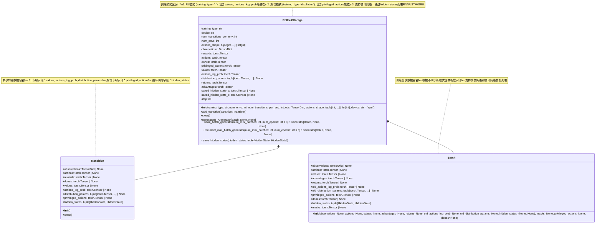

```mermaid
classDiagram
    class RolloutStorage {
        -training_type: str
        -device: str
        -num_transitions_per_env: int
        -num_envs: int
        -actions_shape: tuple[int, ...] | list[int]
        -observations: TensorDict
        -rewards: torch.Tensor
        -actions: torch.Tensor
        -dones: torch.Tensor
        -privileged_actions: torch.Tensor
        -values: torch.Tensor
        -actions_log_prob: torch.Tensor
        -distribution_params: tuple[torch.Tensor, ...] | None
        -returns: torch.Tensor
        -advantages: torch.Tensor
        -saved_hidden_state_a: torch.Tensor | None
        -saved_hidden_state_c: torch.Tensor | None
        -step: int
        
        +__init__(training_type: str, num_envs: int, num_transitions_per_env: int, obs: TensorDict, actions_shape: tuple[int, ...] | list[int], device: str = "cpu")
        +add_transition(transition: Transition)
        +clear()
        +generator() Generator[Batch, None, None]
        +mini_batch_generator(num_mini_batches: int, num_epochs: int = 8) Generator[Batch, None, None]
        +recurrent_mini_batch_generator(num_mini_batches: int, num_epochs: int = 8) Generator[Batch, None, None]
        -_save_hidden_states(hidden_states: tuple[HiddenState, HiddenState])
    }
    
    class Transition {
        +observations: TensorDict | None
        +actions: torch.Tensor | None
        +rewards: torch.Tensor | None
        +dones: torch.Tensor | None
        +values: torch.Tensor | None
        +actions_log_prob: torch.Tensor | None
        +distribution_params: tuple[torch.Tensor, ...] | None
        +privileged_actions: torch.Tensor | None
        +hidden_states: tuple[HiddenState, HiddenState]
        
        +__init__()
        +clear()
    }
    
    class Batch {
        +observations: TensorDict | None
        +actions: torch.Tensor | None
        +values: torch.Tensor | None
        +advantages: torch.Tensor | None
        +returns: torch.Tensor | None
        +old_actions_log_prob: torch.Tensor | None
        +old_distribution_params: tuple[torch.Tensor, ...] | None
        +privileged_actions: torch.Tensor | None
        +dones: torch.Tensor | None
        +hidden_states: tuple[HiddenState, HiddenState]
        +masks: torch.Tensor | None
        
        +__init__(observations=None, actions=None, values=None, advantages=None, returns=None, old_actions_log_prob=None, old_distribution_params=None, hidden_states=(None, None), masks=None, privileged_actions=None, dones=None)
    }
    
    RolloutStorage *-- Transition
    RolloutStorage *-- Batch
    
    note for RolloutStorage "训练模式区分：\n1. RL模式 (training_type='rl'): 包含values、actions_log_prob等属性\n2. 蒸馏模式 (training_type='distillation'): 包含privileged_actions属性\n3. 支持循环网络：通过hidden_states处理RNN/LSTM/GRU"
    
    note for Transition "单步转移数据容器\n- RL专用字段：values, actions_log_prob, distribution_params\n- 蒸馏专用字段：privileged_actions\n- 循环网络字段：hidden_states"
    
    note for Batch "训练批次数据容器\n- 根据不同训练模式提供相应字段\n- 支持前馈网络和循环网络的批处理"
```